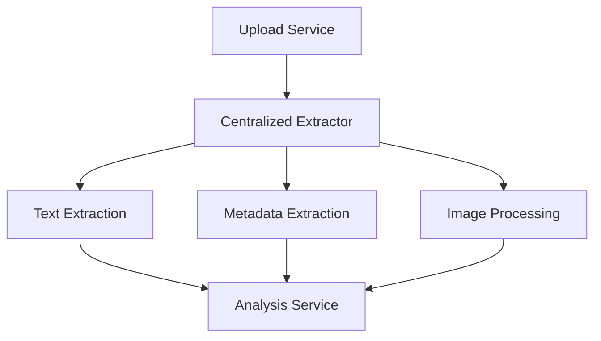
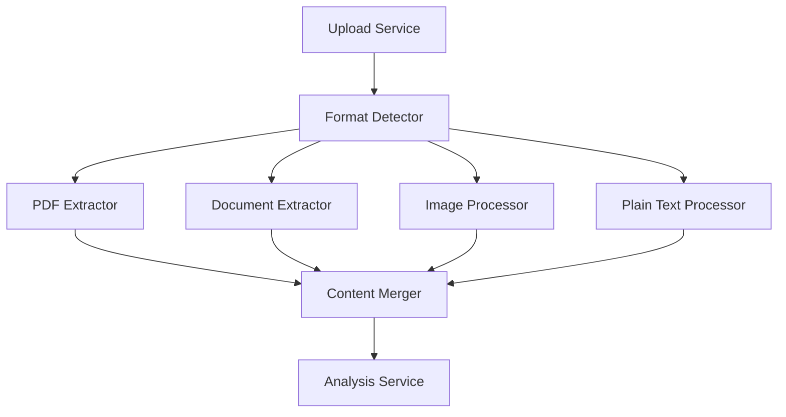
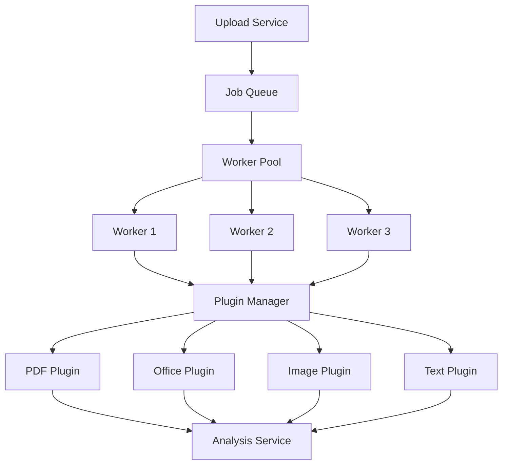
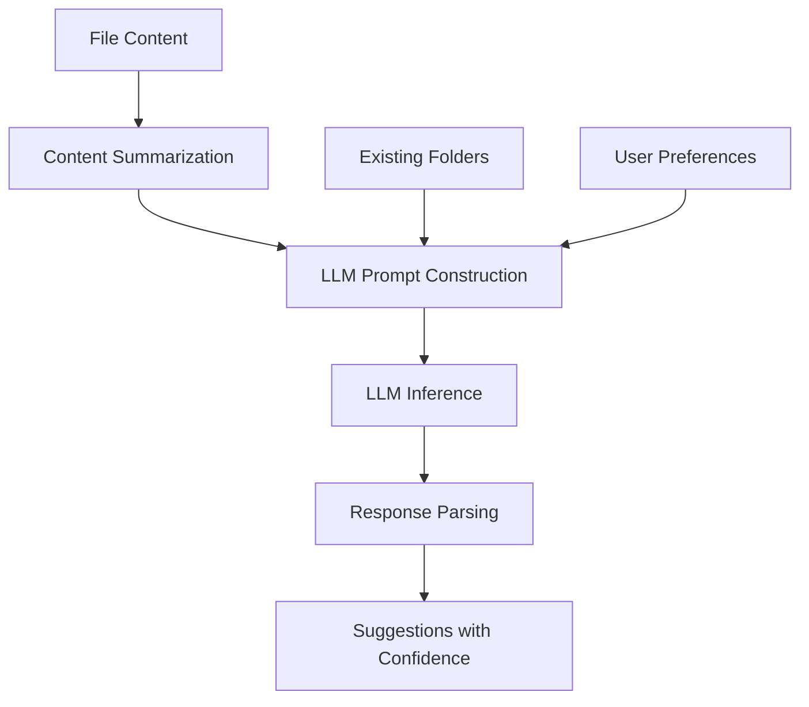
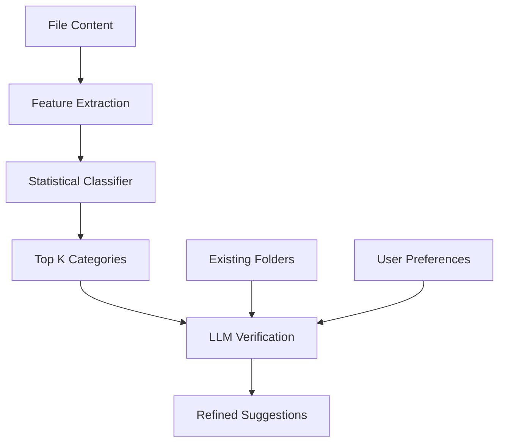
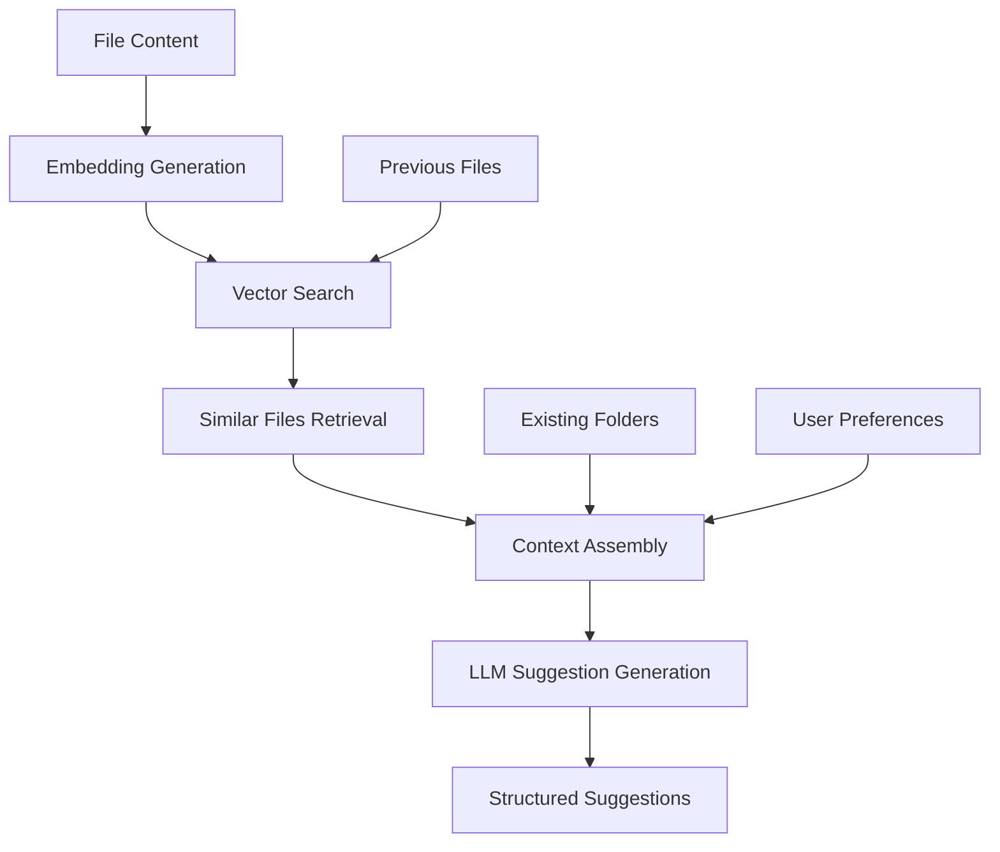
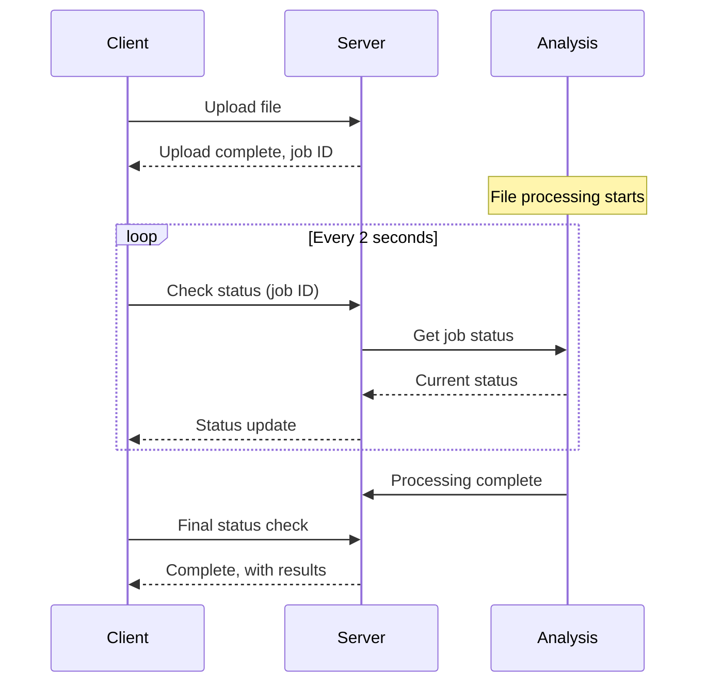
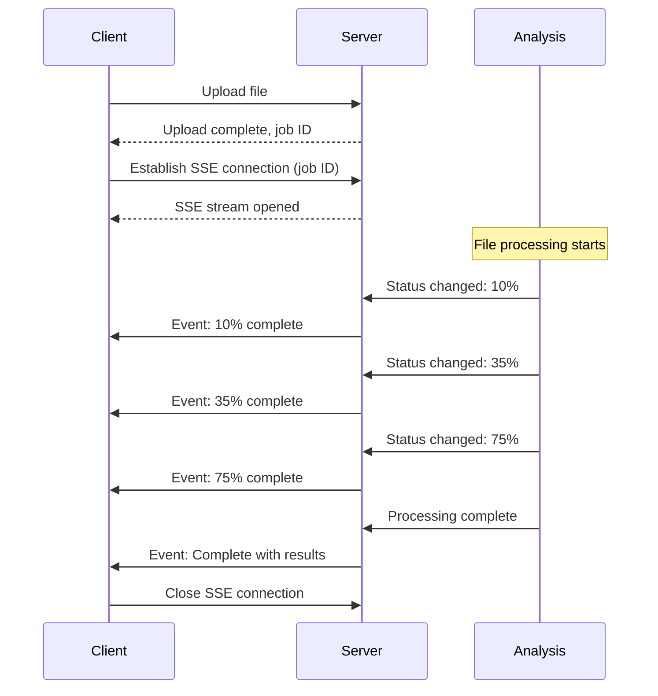

# File Organizer System - Complex Component Design Exploration

## 🎨🎨🎨 ENTERING CREATIVE PHASE: ARCHITECTURE

## 1. File Content Analysis System

The File Content Analysis System is responsible for extracting meaningful content from various file types and preparing it for LLM analysis.

### Requirements & Constraints
- Support multiple file formats (PDF, DOCX, TXT, images, etc.)
- Extract text content efficiently
- Handle large files without excessive memory usage
- Process files in a reasonable timeframe
- Support metadata extraction

### Design Option 1: Centralized Extractor Service



**Pros:**
- Single responsibility for all extraction
- Unified interface for handling all file types
- Centralized error handling and logging
- Easier to manage and monitor processing

**Cons:**
- Single point of failure
- Potential bottleneck for high-volume processing
- May require significant resources on a single node
- Higher complexity in the central service

### Design Option 2: Specialized Microservices



**Pros:**
- Each service optimized for specific file types
- Better scalability for specific file type loads
- Independent deployment and scaling
- Easier to update or add new format handlers

**Cons:**
- More complex orchestration
- Higher latency due to multiple service calls
- More challenging to maintain consistency
- More resources required for multiple services

### Design Option 3: Worker Pool with Plugin Architecture



**Pros:**
- Dynamic scaling based on workload
- Plugins can be updated independently
- Balanced resource utilization
- Good fault tolerance with multiple workers
- Extensible for new file types

**Cons:**
- More complex initial implementation
- Needs careful resource management
- Plugin versioning challenges
- Requires robust job tracking system

### Recommended Approach: Worker Pool with Plugin Architecture

The worker pool with plugin architecture provides the best balance of scalability, extensibility, and fault tolerance. This approach allows:

- Dynamic scaling of workers based on system load
- Easy addition of new file format handlers as plugins
- Better resource utilization across the system
- Fault isolation - a failing plugin doesn't crash the entire system

### Implementation Guidelines
1. Create a job queue system using RabbitMQ or Redis
2. Implement a worker manager that controls the worker pool size
3. Design a plugin interface with standardized input/output contracts
4. Implement format-specific plugins for common file types
5. Develop a job tracking system for monitoring extraction progress
6. Add health monitoring for workers and plugins
7. Implement retry logic for failed extractions

## 🎨🎨🎨 EXITING CREATIVE PHASE

## 🎨🎨🎨 ENTERING CREATIVE PHASE: ALGORITHM

## 2. Organization Suggestion Algorithm

The Organization Suggestion Algorithm is critical for providing relevant folder suggestions based on file content and context.

### Requirements & Constraints
- Generate relevant folder structure suggestions
- Consider existing folder structure
- Account for user preferences and history
- Provide confidence scores for suggestions
- Generate alternative suggestions
- Process quickly enough for interactive use

### Design Option 1: Pure LLM Approach



**Pros:**
- Straightforward implementation
- Leverages LLM's general knowledge
- Can handle novel content types
- Natural language understanding capabilities
- Easier to explain suggestions (reasoning)

**Cons:**
- Potentially high latency due to large context
- May ignore important existing patterns
- Susceptible to LLM hallucinations
- Resource intensive for each suggestion
- Less consistent output format

### Design Option 2: Hybrid Classifier + LLM



**Pros:**
- Faster initial classification
- More consistent categorization
- Lower computational requirements
- Better handling of familiar patterns
- LLM provides reasoning and refinement

**Cons:**
- More complex implementation
- Requires training/maintaining the classifier
- May struggle with truly novel content
- Two-stage process might introduce latency
- Classifier may need periodic retraining

### Design Option 3: Retrieval-Augmented Generation (RAG)



**Pros:**
- Leverages patterns from similar past files
- More consistent with user's organization style
- Lower hallucination risk
- Better handling of domain-specific content
- Improves over time as more files are added

**Cons:**
- Requires vector database maintenance
- Cold start issue with new systems
- More complex implementation
- Sensitive to embedding quality
- May reinforce suboptimal past organizations

### Recommended Approach: Retrieval-Augmented Generation (RAG)

The RAG approach provides the best balance between intelligent suggestions and consistency with user patterns. It combines the strengths of:

- Vector similarity to find relevant examples
- Context from previously organized similar files
- LLM capabilities for understanding content and relationships
- Learning from user behavior over time

### Implementation Guidelines
1. Implement document/file embedding generation during upload
2. Store embeddings in a vector database (Chroma DB or Qdrant)
3. Design a retrieval system that fetches similar previously organized files
4. Create a context assembly module that combines retrieval results with folder structure
5. Design a prompt template that includes retrieved examples and user preferences
6. Implement confidence scoring based on vector similarity and LLM output
7. Add a feedback loop to improve suggestions based on user actions

## 🎨🎨🎨 EXITING CREATIVE PHASE

## 🎨🎨🎨 ENTERING CREATIVE PHASE: UI/UX

## 3. Hierarchical Folder Navigation

The Hierarchical Folder Navigation component must provide an intuitive way to browse a potentially complex folder structure.

### Requirements & Constraints
- Support deeply nested folder structures
- Provide clear visualization of the hierarchy
- Maintain performance with large folder trees
- Allow efficient navigation and folder operations
- Support drag and drop for file organization
- Work across different screen sizes

### Design Option 1: Traditional Tree View

```
┌─────────────────────────┐
│ ▼ Documents             │
│   ▶ Personal            │
│   ▼ Work                │
│     ▶ Projects          │
│     ▼ Reports           │
│       ▶ 2022            │
│       ▼ 2023            │
│         ▶ Q1            │
│         ▼ Q2            │
│           ▶ April       │
│           ▶ May         │
│           ▶ June        │
│     ▶ Presentations     │
│   ▶ Archive             │
└─────────────────────────┘
```

**Pros:**
- Familiar pattern for most users
- Shows the complete hierarchy at once
- Clear parent-child relationships
- Standard interaction patterns
- Efficient use of vertical space

**Cons:**
- Limited horizontal space for deep nesting
- Can become unwieldy with many folders
- May require complex scrolling on mobile
- Indentation reduces available text space
- Performance challenges with very large trees

### Design Option 2: Breadcrumb + Current Level

```
┌─────────────────────────────────────────────┐
│ Home > Documents > Work > Reports > 2023 > Q2│
├─────────────────────────────────────────────┤
│ ┌─────────┐ ┌─────────┐ ┌─────────┐        │
│ │  April  │ │   May   │ │  June   │        │
│ │         │ │         │ │         │        │
│ └─────────┘ └─────────┘ └─────────┘        │
│                                             │
└─────────────────────────────────────────────┘
```

**Pros:**
- Clean, focused view of current level
- Works well on mobile devices
- Simpler implementation
- Better for touch interfaces
- Good for folder browsing (vs. moving files)

**Cons:**
- Limited context of overall structure
- More clicks required for navigation
- Harder to see siblings in different branches
- Less efficient for drag and drop across levels
- May feel limiting for power users

### Design Option 3: Hybrid Approach with Dynamic Expansion

```
┌────────────────────────────────────────────────┐
│ Home > Documents > Work > Reports > 2023 > Q2  │
├────────────────────────────────────────────────┤
│ ┌───────────────┐  ┌────────────────────────┐  │
│ │ ▼ Documents   │  │  CURRENT LEVEL: Q2     │  │
│ │   ▶ Personal  │  │                        │  │
│ │   ▼ Work      │  │  ┌──────┐  ┌──────┐   │  │
│ │     ▶ Projects│  │  │ April│  │ May  │   │  │
│ │     ▼ Reports │  │  └──────┘  └──────┘   │  │
│ │       ▶ 2022  │  │                        │  │
│ │       ▼ 2023  │  │  ┌──────┐             │  │
│ │         ▶ Q1  │  │  │ June │             │  │
│ │         ▼ Q2  │  │  └──────┘             │  │
│ │           ⬤   │  │                        │  │
│ └───────────────┘  └────────────────────────┘  │
└────────────────────────────────────────────────┘
```

**Pros:**
- Combines advantages of both approaches
- Context of the hierarchy and focus on current level
- Adaptable to different screen sizes
- Better support for drag and drop
- Suitable for both casual users and power users

**Cons:**
- More complex implementation
- Requires careful UI design for clarity
- May feel cluttered if not well-designed
- Needs more state management
- Requires more elaborate responsive design

### Recommended Approach: Hybrid Approach with Dynamic Expansion

The hybrid approach provides the best user experience across different devices and use cases. It:

- Shows context through both tree view and breadcrumbs
- Focuses screen space on the current level's content
- Adapts well to different screen sizes
- Supports efficient file organization through drag and drop
- Balances power user needs with simplicity

### Implementation Guidelines
1. Implement a collapsible tree view component for the folder hierarchy
2. Create a breadcrumb component that works in sync with the tree
3. Design a responsive layout that adjusts based on screen size
4. Implement a folder content view that shows items in the current folder
5. Add drag and drop support between tree view and content view
6. Implement keyboard navigation for accessibility
7. Add visual indicators for expanded/collapsed state
8. Use virtualization for performance with large folder structures

## 🎨🎨🎨 EXITING CREATIVE PHASE

## 🎨🎨🎨 ENTERING CREATIVE PHASE: ARCHITECTURE

## 4. Real-time Analysis Status Updates

Users need visibility into the progress of file analysis, especially for larger files that may take time to process.

### Requirements & Constraints
- Provide real-time updates on analysis progress
- Minimize server load for status checks
- Support multiple concurrent file uploads
- Handle connection interruptions gracefully
- Display appropriate UI feedback

### Design Option 1: Polling



**Pros:**
- Simple implementation
- Works with any HTTP server
- No special server requirements
- Resilient to connection issues
- Easy to implement retry logic

**Cons:**
- Higher server load with frequent requests
- Potential latency in updates
- Less efficient network usage
- More complex client-side logic
- May miss brief status changes

### Design Option 2: WebSockets


**Pros:**
- Real-time updates
- Reduced server load
- More efficient network usage
- Immediate feedback to users
- Can handle streaming results

**Cons:**
- More complex server implementation
- Requires WebSocket support
- Connection management overhead
- More difficult to implement reconnection logic
- Potential proxy/firewall issues

### Design Option 3: Server-Sent Events (SSE)



**Pros:**
- Real-time updates like WebSockets
- Simpler server implementation than WebSockets
- Better browser support
- Automatic reconnection
- Works with standard HTTP
- One-way communication fits this use case

**Cons:**
- Limited to text-based messages
- Less efficient than WebSockets for bi-directional communication
- Some proxies may buffer responses
- Not as widely supported as polling
- Maximum number of concurrent connections

### Recommended Approach: Server-Sent Events with Polling Fallback

Server-Sent Events provides the best balance between real-time updates and implementation simplicity for this use case. Adding polling as a fallback ensures compatibility across all environments.

- SSE is well-suited for server-to-client updates
- Automatic reconnection handling
- Works over standard HTTP
- Simpler than WebSockets for this specific need
- Polling fallback ensures universal compatibility

### Implementation Guidelines
1. Implement an event emitter on the server for analysis status updates
2. Create an SSE endpoint for clients to connect to (/analysis/{job_id}/events)
3. Implement a polling endpoint as fallback (/analysis/{job_id})
4. Design the client to try SSE first, then fall back to polling if needed
5. Add reconnection logic with exponential backoff
6. Implement a message format that includes progress percentage, stage, and status
7. Add UI components that visualize the progress (progress bar, status messages)
8. Handle connection termination gracefully on both sides

## 🎨🎨🎨 EXITING CREATIVE PHASE 