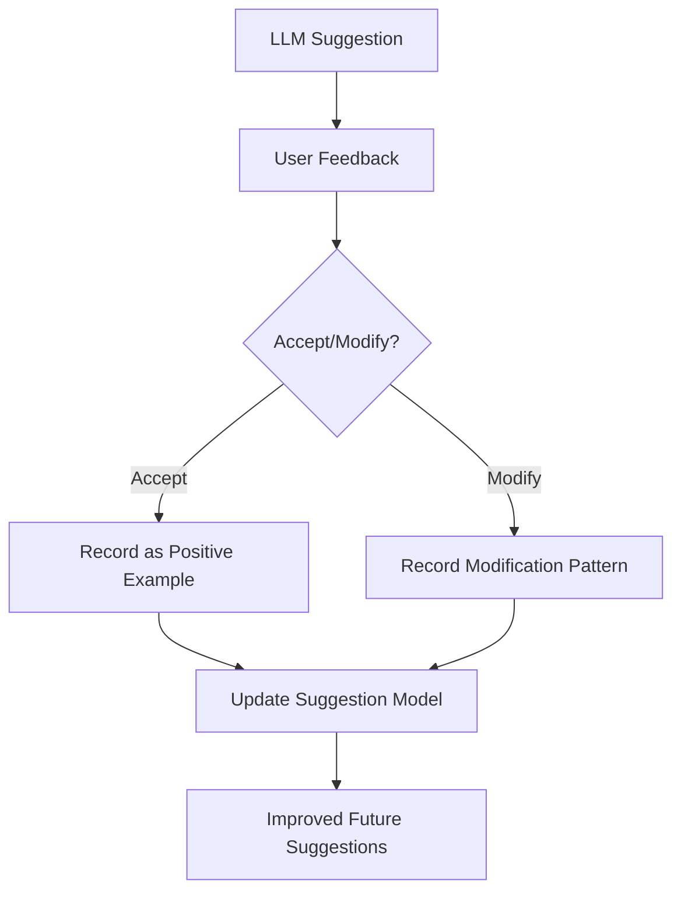

# File Organizer System - LLM Integration Design (Updated)

## LLM Integration Overview

The File Organizer System uses a hybrid architecture for LLM-powered file organization, combining a Node.js/Express backend, a FastAPI-based Model Control Platform (MCP) microservice, and a Chroma vector database for Retrieval-Augmented Generation (RAG). The system supports single, batch, and folder-level organization suggestions, all powered by context-aware LLM prompts.

---

## Current Architecture

- **Frontend:** React (Material UI, React Query)
- **Backend:** Node.js/Express, Prisma, PostgreSQL
- **LLM Microservice (MCP):** FastAPI, LangChain, OpenRouter/OpenAI API
- **Vector DB:** Chroma DB (Dockerized, used for RAG context)
- **Embeddings:** OpenAI API (text-embedding-ada-002) or local model (future)

---

## RAG Pipeline Diagram

```mermaid
graph TD
    U[User Uploads File] --> B[Backend: Save File & Metadata]
    B --> E[Extract Content]
    E --> M[Generate Embedding]
    M --> C[Store in Chroma DB]
    E --> Q[Query Chroma for Similar Files]
    Q --> RAG[RAG Context Assembly]
    C --> Q
    RAG --> MCP1[MCP /api/analyze (Prompt Engineering)]
    MCP1 --> MCP2[MCP /api/organize (LLM Suggestion)]
    MCP2 --> S[Suggestion Returned to User]
```

---

## LLM Flow & RAG Pipeline

### 1. File Upload & Storage
- User uploads files via the frontend.
- Backend saves files to disk and stores metadata in PostgreSQL.

### 2. Content Extraction & Embedding
- On organization request (single, batch, or folder):
  - Backend extracts file content (PDF, text, image OCR, etc.).
  - Generates an embedding for the file content (OpenAI API).
  - Stores embedding and metadata in Chroma DB (if not already present).

### 3. RAG Context Retrieval
- Backend queries Chroma DB for similar files (semantic search).
- Assembles a RAG context: file content, metadata, tags, and similar files.

### 4. LLM Prompt Engineering (MCP)
- Backend sends the RAG context (as JSON) to MCP `/api/analyze` (Model 1).
- MCP parses the context, builds a rich prompt including file content, metadata, tags, and similar files.
- MCP generates a summary and organization prompt using LangChain and OpenRouter/OpenAI LLM.
- MCP `/api/organize` (Model 2) receives the prompt and returns folder/tag suggestions, confidence, summary, and reasoning.

### 5. Batch & Folder Organization
- For batch/folder requests, backend builds a RAG context for each file and aggregates them.
- Sends all contexts to MCP `/api/organize/batch` or `/api/organize/folder` for group suggestions.

---

## Example Prompt Flow

1. **Backend builds RAG context:**
```json
{
  "fileContent": "...extracted text...",
  "fileMetadata": { ... },
  "tags": ["finance", "report"],
  "similarFiles": [ { ... }, ... ]
}
```
2. **MCP prompt template:**
```
Summarize the following file and its context (metadata, tags, similar files). Extract key topics and keywords, and generate a prompt for organization.

{content}

Summary:
```
3. **LLM output is used as the organization prompt for Model 2.**

---

## Feedback Loop and Improvement



---

## Deployment & Configuration

- **Chroma DB:**
  - Run via Docker: `docker run -d -p 8000:8000 ghcr.io/chroma-core/chroma:latest`
  - Set `CHROMA_URL=http://localhost:8000` in backend `.env`
- **OpenAI API:**
  - Set `OPENAI_API_KEY` in backend `.env`
- **MCP:**
  - FastAPI app, uses LangChain and OpenRouter/OpenAI for LLM calls
  - Receives RAG context and returns suggestions

---

## Supported Features
- Single-file, batch, and folder-level organization suggestions
- Context-aware (RAG) LLM prompting
- Tag and folder suggestions with confidence and reasoning
- Modern, responsive UI for all organization flows

---

## Future Enhancements
- Local embedding model support (e.g., all-MiniLM-L6-v2)
- More advanced chunking and context assembly
- User feedback loop for continual improvement
- Caching and performance optimizations

---

## References
- See `README.md` for setup and usage
- See backend and MCP source for implementation details 