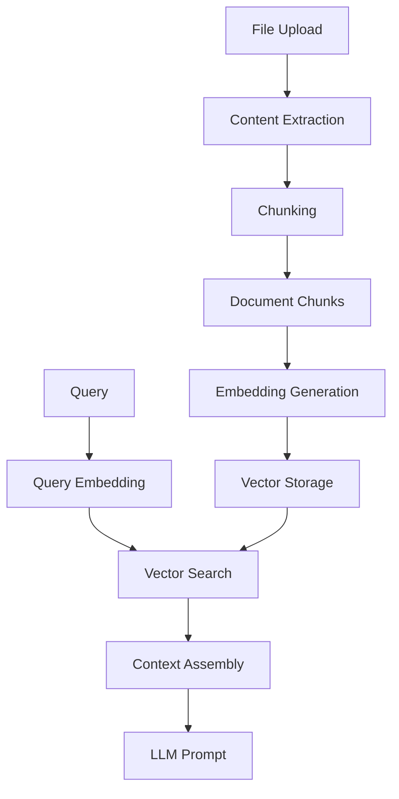
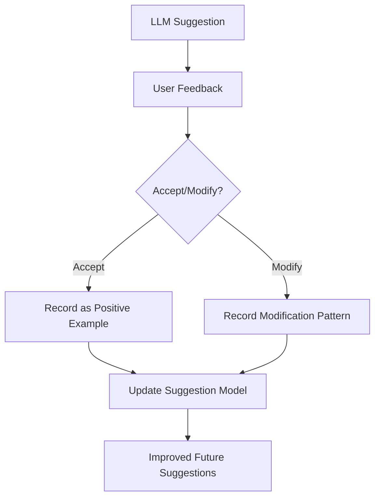

# File Organizer System - LLM Integration Design

## LLM Integration Overview

The File Organizer System leverages a local LLM to analyze file content and suggest appropriate organization structures. This document outlines the design for integrating a local LLM into the system, focusing on performance, accuracy, and resource efficiency.

## LLM Selection Criteria

When selecting a local LLM for file organization, the following criteria should be considered:

1. **Performance**: Model should run efficiently on consumer hardware
2. **Size**: Balance between model size and performance
3. **Context Window**: Large enough to process substantial portions of files
4. **Task Specialization**: Good at classification and content understanding
5. **Resource Usage**: Manageable RAM and CPU requirements

### Recommended Models

| Model | Size | Context Window | RAM Requirement | Strengths | Use Case |
|-------|------|---------------|-----------------|-----------|----------|
| Llama 3 8B | ~4GB | 8K tokens | 8GB | Good balance of size and quality | General purpose, low resource systems |
| Llama 3 70B | ~35GB | 8K tokens | 48GB+ | High quality, better understanding | High-end systems, complex categorization |
| Mistral 7B | ~4GB | 8K tokens | 8GB | Efficient, good at instruction following | General purpose, low resource systems |
| Phi-3 Mini | ~1.8GB | 4K tokens | 4GB | Very small, efficient | Very low resource systems |
| Mixtral 8x7B | ~24GB | 32K tokens | 32GB+ | Large context window, high quality | Complex document analysis |

## LLM Runtime Environment

### Deployment Options

1. **Ollama**
   - Easiest deployment with simple API
   - Good for development and small deployments
   - Limited customization and optimization

2. **llama.cpp**
   - Highly optimized for CPU inference
   - Supports model quantization for reducing memory requirements
   - More complex setup but better performance

3. **vLLM**
   - Better for systems with GPU
   - High throughput for batch processing
   - More resource intensive

### Recommended Configuration

```yaml
# Docker Compose Configuration for LLM Service
services:
  llm-service:
    image: ollama/ollama:latest
    ports:
      - "11434:11434"
    volumes:
      - ./ollama-models:/root/.ollama
    deploy:
      resources:
        limits:
          memory: 16G
          cpus: '4'
    environment:
      - OLLAMA_HOST=0.0.0.0
      - OLLAMA_MODELS=llama3:8b
```

## File Content Analysis Pipeline

### Content Extraction

1. **Text Extraction by File Type**:
   - PDF: PyPDF, pdf.js
   - Images: OCR via Tesseract
   - Office Documents: textract, apache-tika
   - Plain text: direct reading

2. **Metadata Extraction**:
   - Exiftool for media files
   - Document properties from office files
   - File system metadata (creation date, size, etc.)

### Content Processing

1. **Chunking Strategy**:
   - Fixed size chunks with overlap
   - Semantic chunking based on document structure
   - Adaptive chunking based on content complexity

2. **Preprocessing**:
   - Remove boilerplate content
   - Extract key sections (titles, headings, etc.)
   - Normalize text (spacing, encoding, etc.)

## RAG Implementation

### Vector Database Integration



1. **Embedding Model Selection**:
   - all-MiniLM-L6-v2: Lightweight, good for low resource systems
   - all-mpnet-base-v2: Better quality but more resource intensive
   - Local embedding models vs. pre-computed embeddings

2. **Vector Database**:
   - Chroma DB: Simple setup, Python native
   - Qdrant: Better performance for larger collections

### RAG Pipeline Components

1. **Document Processor**:
   - Handles document chunking
   - Extracts metadata
   - Preprocesses text for embedding

2. **Embedding Manager**:
   - Generates embeddings for document chunks
   - Handles batch processing
   - Optimizes for resource usage

3. **Retrieval Engine**:
   - Performs semantic search
   - Combines with keyword search for hybrid retrieval
   - Filters results based on metadata

4. **Context Assembler**:
   - Selects most relevant chunks
   - Formats context for LLM prompt
   - Manages context window constraints

## LLM Prompting Strategy

### Organization Prompt Template

```
You are an intelligent file organizer assistant. Your task is to analyze the file content and suggest the most appropriate folder structure for organizing it.

### File Information:
- File Name: {{filename}}
- File Type: {{filetype}}
- File Size: {{filesize}}
- Created Date: {{created_date}}
- Last Modified: {{last_modified}}

### File Content Sample:
{{content_sample}}

### Existing Categories:
{{existing_categories}}

Based on the file content and metadata, determine the best folder location for this file. Provide your answer in the following JSON format:

{
  "suggested_path": "path/to/suggested/folder",
  "confidence": 0.85,
  "alternative_paths": ["alt/path/1", "alt/path/2"],
  "suggested_tags": ["tag1", "tag2", "tag3"],
  "content_summary": "Brief summary of what this file contains",
  "reasoning": "Explanation for why this organization was chosen"
}
```

### Performance Optimization

1. **Batched Processing**:
   - Group similar files for batched inference
   - Process files during system idle time

2. **Caching Strategy**:
   - Cache embeddings for document chunks
   - Cache similar document analyses
   - Cache LLM responses for similar queries

3. **Progressive Loading**:
   - Start with small chunks of large files
   - Progressively analyze more content as needed
   - Use metadata-based suggestions for initial quick results

## Feedback Loop and Improvement



1. **User Feedback Collection**:
   - Track acceptance rate of suggestions
   - Record manual changes to suggestions
   - Collect explicit feedback on quality

2. **Model Adaptation**:
   - Fine-tune prompts based on user patterns
   - Adjust relevance criteria based on feedback
   - Learn user-specific organization preferences

## Error Handling and Fallbacks

1. **LLM Service Unavailability**:
   - Fallback to basic metadata-based organization
   - Queue analysis tasks for when service is available
   - Provide manual organization options

2. **Content Extraction Failures**:
   - Fallback to filename and metadata analysis
   - Log extraction errors for review
   - Notify user of limited analysis

3. **Response Validation**:
   - Validate LLM output format
   - Handle hallucinations and incorrect suggestions
   - Implement confidence thresholds for suggestions

## Resource Management

1. **Memory Usage Control**:
   - Implement model unloading when idle
   - Use quantized models for lower memory footprint
   - Limit batch sizes based on available memory

2. **Processing Prioritization**:
   - Prioritize user-initiated requests
   - Background processing for batch uploads
   - Throttle processing during high system load

3. **Storage Efficiency**:
   - Compress embeddings where possible
   - Implement TTL for cached results
   - Prune embeddings for deleted files

## Implementation Roadmap

1. **Phase 1: Basic LLM Integration**
   - Set up LLM service with Ollama
   - Implement basic text extraction for common file types
   - Create simple organization prompts

2. **Phase 2: RAG Enhancement**
   - Implement vector database
   - Create embedding pipeline
   - Develop context retrieval system

3. **Phase 3: Performance Optimization**
   - Implement caching strategies
   - Optimize for resource usage
   - Add batch processing capabilities

4. **Phase 4: Feedback and Improvement**
   - Add user feedback collection
   - Implement prompt refinement system
   - Create adaptation mechanisms 