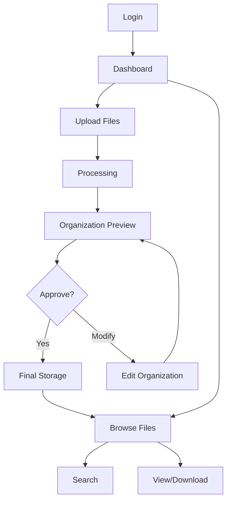
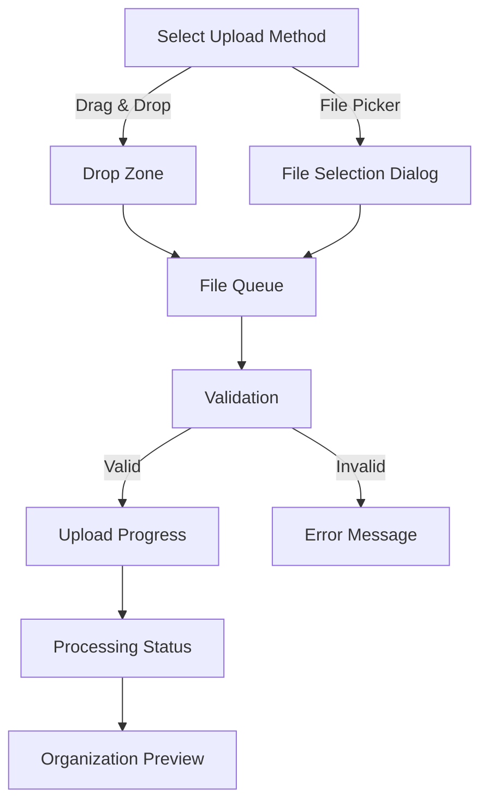

# File Organizer System - UI/UX Design

## Design Philosophy

The File Organizer System's user interface is designed with the following principles:

1. **Simplicity**: Intuitive interactions without overwhelming complexity
2. **Transparency**: Clear visibility into AI-suggested organization
3. **Control**: User maintains final decision-making authority
4. **Efficiency**: Minimize clicks and interactions for common tasks
5. **Responsiveness**: Adapts to different screen sizes and devices

## User Flow Diagrams

### Main User Flow



### File Upload Flow



## Screen Designs

### Dashboard

The dashboard provides an overview of the file system and recent activities.

```
┌─────────────────────────────────────────────────────────────┐
│ ┌─────┐ File Organizer                            User ▼    │
│ │ Logo│                                                     │
│ └─────┘                                                     │
├─────────────────────────────────────────────────────────────┤
│ ┌───────────┐ ┌─────────────────┐ ┌─────────────────────┐  │
│ │           │ │                 │ │                     │  │
│ │ FOLDERS   │ │ RECENT FILES    │ │   STATISTICS        │  │
│ │           │ │                 │ │                     │  │
│ │ Documents │ │ - Report.pdf    │ │ Total Files: 256    │  │
│ │ Images    │ │ - Image.jpg     │ │ Used Space: 1.2 GB  │  │
│ │ Videos    │ │ - Notes.txt     │ │ Categories: 15      │  │
│ │ Work      │ │ - Presentation  │ │                     │  │
│ │  └─ Reports│ │                 │ │                     │  │
│ │  └─ Drafts │ │                 │ │                     │  │
│ │           │ │                 │ │                     │  │
│ └───────────┘ └─────────────────┘ └─────────────────────┘  │
│                                                             │
│ ┌─────────────────────────────┐ ┌─────────────────────────┐│
│ │                             │ │                         ││
│ │      UPLOAD FILES           │ │    QUICK SEARCH         ││
│ │                             │ │                         ││
│ │   [   UPLOAD BUTTON    ]    │ │ ┌───────────────────┐   ││
│ │                             │ │ │ Search...         │   ││
│ │                             │ │ └───────────────────┘   ││
│ │                             │ │                         ││
│ └─────────────────────────────┘ └─────────────────────────┘│
└─────────────────────────────────────────────────────────────┘
```

### File Upload and Organization Preview

This screen allows users to upload files and preview the suggested organization.

```
┌─────────────────────────────────────────────────────────────┐
│ ┌─────┐ File Organizer > Upload                    User ▼   │
│ │ Logo│                                                     │
│ └─────┘                                                     │
├─────────────────────────────────────────────────────────────┤
│ ┌─────────────────────────────────────────────────────────┐ │
│ │                                                         │ │
│ │  DROP FILES HERE OR CLICK TO SELECT                     │ │
│ │                                                         │ │
│ │  ┌───────────────────────────────────────────────────┐  │ │
│ │  │                                                   │  │ │
│ │  │                     📄                            │  │ │
│ │  │                                                   │  │ │
│ │  │                                                   │  │ │
│ │  └───────────────────────────────────────────────────┘  │ │
│ │                                                         │ │
│ │                  [    SELECT FILES    ]                 │ │
│ │                                                         │ │
│ └─────────────────────────────────────────────────────────┘ │
│                                                             │
│ ┌─────────────────────────┐ ┌───────────────────────────┐  │
│ │ UPLOAD QUEUE (2)        │ │ ORGANIZATION PREVIEW      │  │
│ ├─────────────────────────┤ ├───────────────────────────┤  │
│ │ ✓ report-q2.pdf         │ │ report-q2.pdf             │  │
│ │   Analyzing... 80%      │ │ └─ Work                   │  │
│ │                         │ │    └─ Reports             │  │
│ │ ✓ sales-data.xlsx       │ │       └─ 2023             │  │
│ │   Waiting for analysis  │ │          └─ Q2            │  │
│ │                         │ │ Tags: financial, quarterly│  │
│ │                         │ │                           │  │
│ │                         │ │ Confidence: 92%           │  │
│ │                         │ │                           │  │
│ │ [  UPLOAD MORE FILES  ] │ │ [ACCEPT] [MODIFY] [SKIP]  │  │
│ └─────────────────────────┘ └───────────────────────────┘  │
└─────────────────────────────────────────────────────────────┘
```

### Folder Navigation and Search

This screen allows users to browse the folder structure and search for files.

```
┌─────────────────────────────────────────────────────────────┐
│ ┌─────┐ File Organizer > Browse                    User ▼   │
│ │ Logo│                                                     │
│ └─────┘                                                     │
├─────────────────────────────────────────────────────────────┤
│ ┌───────────────────┐ ┌─────────────────────────────────┐  │
│ │ FOLDERS           │ │ Work > Reports > 2023 > Q2      │  │
│ ├───────────────────┤ ├─────────────────────────────────┤  │
│ │ ▼ Documents       │ │ ┌──────────────────────────────┐│  │
│ │   ▶ Personal      │ │ │ SEARCH:                      ││  │
│ │   ▶ Work          │ │ │ ┌────────────────────┐ [GO]  ││  │
│ │ ▶ Images          │ │ │ │                    │       ││  │
│ │ ▶ Videos          │ │ │ └────────────────────┘       ││  │
│ │ ▶ Music           │ │ └──────────────────────────────┘│  │
│ │ ▶ Downloads       │ │                                 │  │
│ │                   │ │ 4 files, sorted by: Date ▼     │  │
│ │                   │ │                                 │  │
│ │                   │ │ ┌─────┐ ┌─────┐ ┌─────┐ ┌─────┐│  │
│ │                   │ │ │FILE │ │FILE │ │FILE │ │FILE ││  │
│ │                   │ │ │  1  │ │  2  │ │  3  │ │  4  ││  │
│ │                   │ │ └─────┘ └─────┘ └─────┘ └─────┘│  │
│ │ [  NEW FOLDER  ]  │ │                                 │  │
│ │                   │ │                                 │  │
│ └───────────────────┘ └─────────────────────────────────┘  │
└─────────────────────────────────────────────────────────────┘
```

### Organization Edit Dialog

This dialog allows users to modify the suggested organization structure.

```
┌─────────────────────────────────────────────────────────────┐
│               MODIFY ORGANIZATION - report-q2.pdf           │
├─────────────────────────────────────────────────────────────┤
│                                                             │
│  Current Path: Work > Reports > 2023 > Q2                   │
│                                                             │
│  ┌──────────────────────────┐ ┌──────────────────────────┐  │
│  │ FOLDER STRUCTURE         │ │ SUGGESTED TAGS           │  │
│  │                          │ │                          │  │
│  │ ▼ Work                   │ │ [x] financial            │  │
│  │   ▼ Reports              │ │ [x] quarterly            │  │
│  │     ▼ 2023               │ │ [ ] report               │  │
│  │       ▼ Q2               │ │ [ ] sales                │  │
│  │                          │ │                          │  │
│  │ Select a folder or       │ │ + Add custom tag:        │  │
│  │ click to create new:     │ │ ┌────────────────┐       │  │
│  │                          │ │ │                │ [ADD] │  │
│  │ [  NEW FOLDER  ]         │ │ └────────────────┘       │  │
│  │                          │ │                          │  │
│  └──────────────────────────┘ └──────────────────────────┘  │
│                                                             │
│  AI Confidence: 92%                                         │
│  Alternative Suggestions:                                   │
│  - Work > Financial > Reports > 2023                        │
│  - Documents > Work > Financial Reports                     │
│                                                             │
│            [   CANCEL   ]    [   SAVE CHANGES   ]           │
└─────────────────────────────────────────────────────────────┘
```

## Component Specifications

### File Uploader Component

The file uploader component handles file selection and uploading.

**Features:**
- Drag and drop support
- Multiple file selection
- Progress indication
- File type validation
- Upload queue management

**States:**
- Idle: Initial state, ready for file selection
- Dragging: User is dragging files over the drop zone
- Uploading: Files are being uploaded to the server
- Error: Upload failed or invalid file type
- Success: Upload completed successfully

### Folder Tree Component

The folder tree component displays the hierarchical folder structure.

**Features:**
- Expand/collapse folders
- Select current folder
- Context menu for folder operations
- Visual indication of nested levels
- Create new folder functionality

**States:**
- Default: Normal display state
- Selected: Currently active folder
- Expanded: Folder is open showing children
- Collapsed: Folder is closed hiding children
- Dragging: User is dragging items over folder

### Organization Preview Component

The organization preview component shows the suggested file organization and allows user confirmation.

**Features:**
- Visual tree representation of suggested path
- Confidence indicator
- Accept/modify/skip buttons
- Tag display and editing
- Alternative suggestions display

**States:**
- Loading: Waiting for AI analysis
- Preview: Showing suggestion waiting for user action
- Editing: User is modifying the suggestion
- Confirmed: User has accepted the suggestion
- Skipped: User has skipped automatic organization

## Responsive Design Strategy

The application will implement a responsive design approach to ensure usability across different devices and screen sizes:

### Desktop (1024px and above)
- Full three-panel layout (folder tree, file list, details)
- Advanced drag and drop functionality
- Keyboard shortcuts
- Detailed preview panels

### Tablet (768px to 1023px)
- Collapsible sidebar for folder tree
- Grid or list toggle for file display
- Simplified drag and drop
- Touch-friendly controls

### Mobile (below 768px)
- Single panel layout with navigation menus
- Bottom navigation bar for quick access
- Simplified upload process
- Progressive disclosure of advanced features

## Animation and Transition Guidelines

Animations and transitions should enhance the user experience without causing delays:

- **Duration**: 150-200ms for UI element transitions
- **Timing Function**: Ease-in-out for smooth transitions
- **Purpose**: Animations should convey meaning (e.g., progress, hierarchy, relationship)
- **Performance**: Optimize for low CPU/GPU usage
- **Accessibility**: Respect user preferences for reduced motion

## Accessibility Considerations

The UI will be designed with accessibility in mind:

- **Keyboard Navigation**: Full keyboard support for all actions
- **Screen Reader Support**: ARIA labels and semantic HTML
- **Color Contrast**: Minimum 4.5:1 ratio for text
- **Focus Indicators**: Clear visual indication of focused elements
- **Text Sizing**: Support for browser text zoom
- **Error States**: Clear visual and textual error indications

## User Feedback Mechanisms

The system will provide clear feedback to users through:

- **Toast Notifications**: For operation completion and errors
- **Progress Indicators**: For uploads and processing
- **Inline Validation**: For form inputs
- **Status Updates**: For background processes
- **Confirmation Dialogs**: For destructive actions

## Implementation Notes

The UI will be implemented using React with Material UI components. Key technical considerations include:

- Use of React context for state management
- Component composition for reusability
- Custom hooks for shared logic
- Server-side rendering for initial load performance
- Code splitting for faster loading times
- Optimized rendering for large file lists
- WebSocket connections for real-time updates 